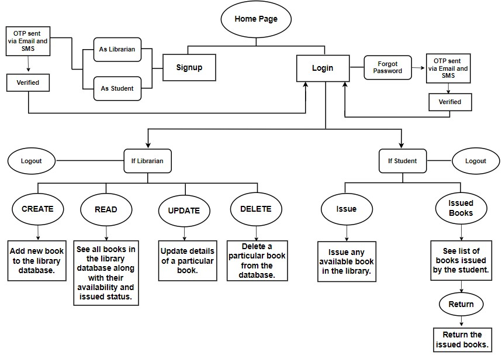
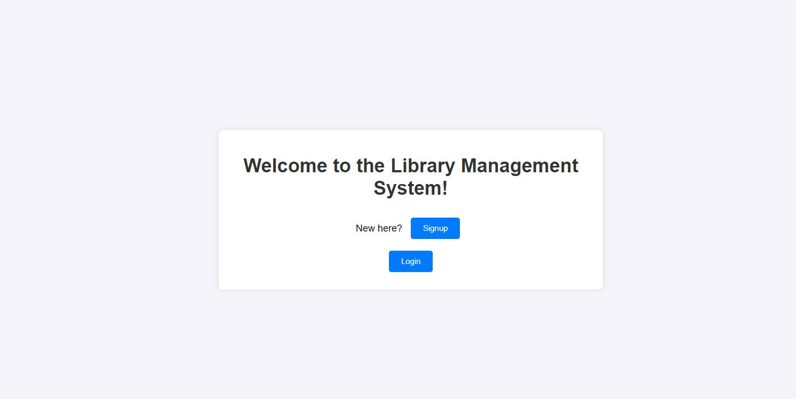
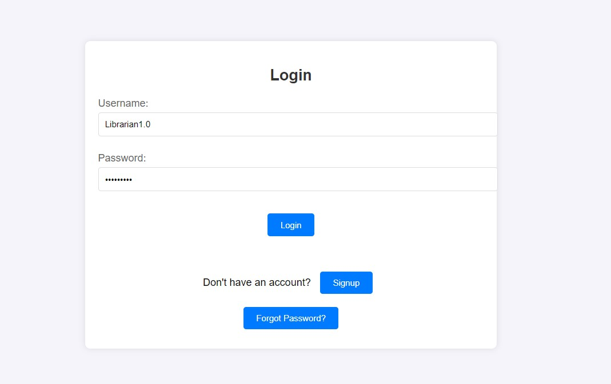
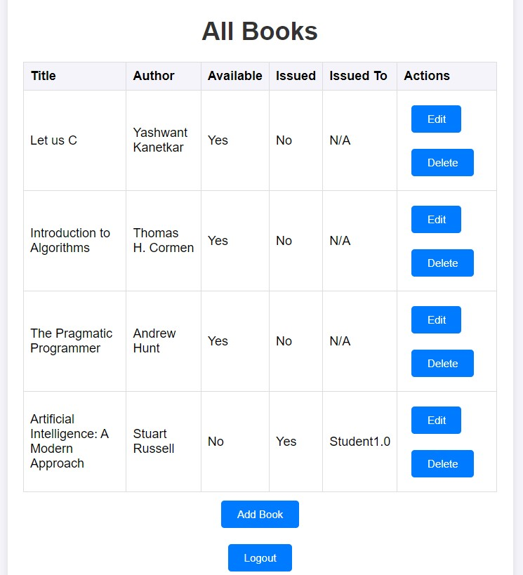
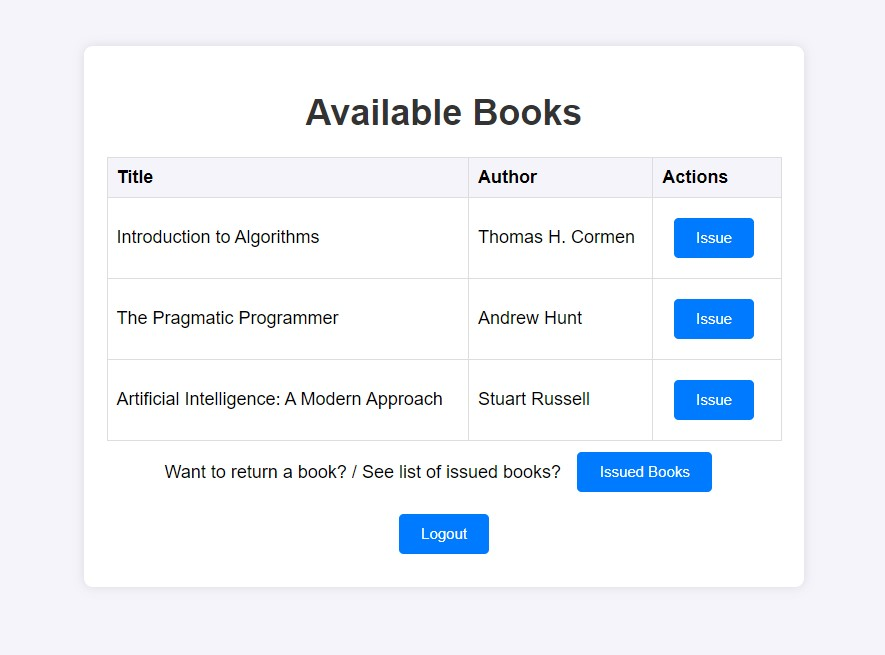
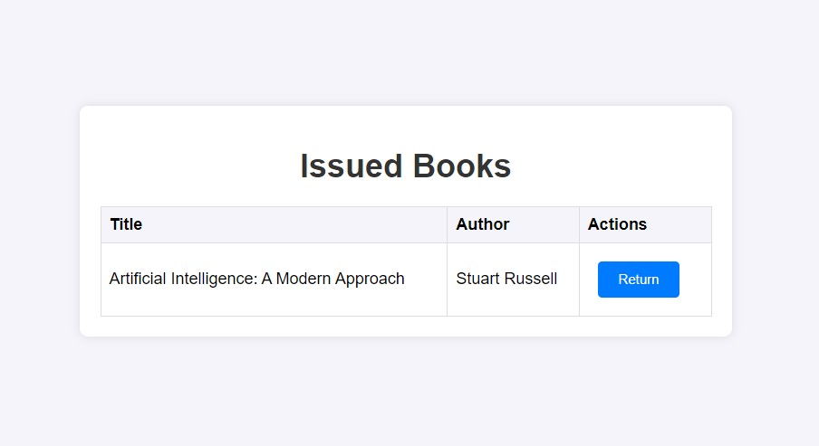
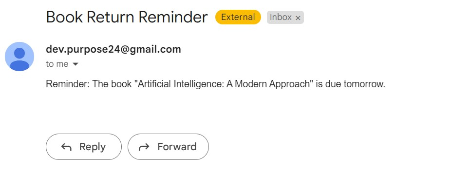

# Library Management System

This is a Library Management System Website having Authentication, Librarian side functionality, Student side functionality and reminder sending functionality built using [Django](https://www.djangoproject.com/).

## Structure and Working


## Features

- Developed Two-Factor Authentication by sending OTPs via both Email (using SMTP) and Text message (using Twilio API).
- Implemented CRUD operations using Django ORM - allowing the Librarian to handle the books in the database effectively.
- Developed features for issuing and returning the books in the Student side functionality.
- Devised a reminder functionality using Windows Task Scheduler which sent reminder Email and Text Message to respective Student to return the book, one day prior to the due-date.
- Developed a clean UI for the system using HTML/CSS.

## Demonstration 

### Home Page


### Login Page


### Librarian side functionality

- Librarian is able to see list of all books in the library database, add a new book, update details of a particular book and delete a particular book from the database.

#### Student side functionality

- Student can see list of books available in the library for issuing. 

#### Book returning functionality

- Student can see list of issued books and can return them. 

#### Reminder functionality

- Screenshot of Reminder Email sent to respective Student, one day prior to the due-date.

## Setup

1. Clone the repository:
   ```sh
   git clone https://github.com/lakshaysawhney/Library-Management-System.git
